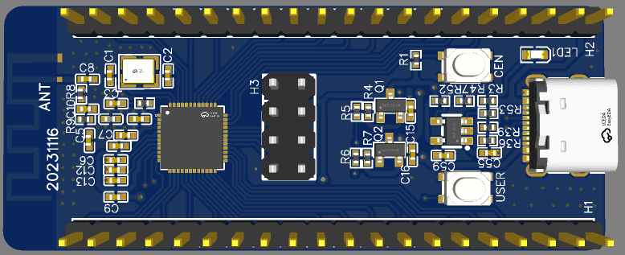

# Beken Development Kit on FreeRTOS

The BDK FreeRTOS supports multiple Beken chips, including BK7231N, BK7231U, BK7251. This repo mainly use BK7231U USB devices.


## Hardware

We use BK7231U 48pin chip that supports USB Host/Device, and SCH and PCB are located in Hardware directory.



Pin assignment:


## Get Started

Download arm gcc toolchain from https://developer.arm.com/downloads/-/gnu-rm, and set env `FREERTOS_EXEC_PATH`, for example

```
export FREERTOS_EXEC_PATH=/opt/toolchain/gcc-arm-none-eabi-5_4-2016q3/bin/
```

Current bash and zsh shell is supported, you may change you /bin/sh to bash or zsh.

Download source code and compile

```
git clone https://github.com/tiancj/bdk_freertos
make bk7231u -j$(nproc)
```

The generated binary is `out/beken7231_bsp_crc.bin` and `out/all_2M.1220.bin`. The former bin doesn't contain bootloader, while the latter contains bootloader.

## Flash

Download Flash tool from https://github.com/tiancj/hid_download_py, and follow the instruction there to install it.

If BK7231U is a blank chip, you need to flash it a bootloader or a bin that contains bootloader.

Connect SPI flasher to BK7231U, and run the following command:

```
hidprogram out/all_2M.1220.bin
```

After flash the bootloader, you doesn't need the SPI flasher to flash bootloader later. Instead, you can use UART to flash.

```
uartprogram out/beken7231_bsp_crc.bin
```

Default baudrate is 115200 8N1, and console log is at UART1.

Then enjoy!

## Supported functions

* WiFi (use `sta` command to connect to AP, or `softap` command to setup a hotspot)
* USB Device (CherryUSB and Mentor USB), such as HID, MSC, CDC, etc.
* UF2 bootloader (enable `CFG_UF2` in `app/sys_config_bk7231u.h`)

## Todo

- [ ] opensource bootloader
- [ ] USB SPI, I2C, PWM, SD/SDIO, ADC, IrDA, MJPEG, etc devices
- [ ] Linux device drivers for these USB device
- [ ] opensource wifi 4 protocol stack (softmac)

## Documents

v There are original Beken documents at `documents` directory, which includes SDK API and User Guide. SDK API is recommended to read to familiar with API that used to develope user applications. If you want to develop USB devices or Host devices, please refer CherryUSB APIs at https://cherryusb.readthedocs.io/.

## Contribution

Thanks the following repos:

* cherryuf2: https://github.com/zhaqian12/Cherryuf2
* platform_bk7231t: https://github.com/warewolf/platform_bk7231t
* OpenBK7231T: https://github.com/openshwprojects/OpenBK7231T
* CherryUSB: https://github.com/cherry-embedded/CherryUSB
